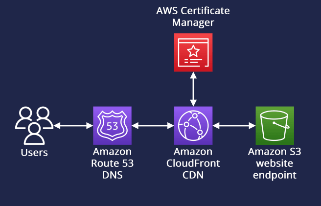

# Personal Portfolio

This repository contains the Terraform code and CI/CD pipelines for deploying and managing a highly available, scalable, and secure personal portfolio website on AWS.

## Cloud Architecture

The architecture is designed following AWS best practices for hosting static websites, emphasizing security, performance, and cost-efficiency. It is a completely serverless solution.

### Core Components & Design Rationale

1.  **Route 53 (DNS Management):**
    *   **Role:** Manages the custom domain and DNS resolution.
    *   **Implementation:** An `A` record with the `Alias` feature points the domain to the CloudFront distribution. Using an Alias record is an AWS-native solution that is more robust than a traditional CNAME, allowing the root domain (e.g., `your-domain.com`) to point directly to AWS resources.

2.  **CloudFront (Content Delivery Network):**
    *   **Role:** Acts as the secure, high-performance front door for the website.
    *   **Performance:** Caches static content at AWS edge locations globally. This significantly reduces latency for users by serving content from a location geographically closer to them.
    *   **Security:**
        *   **SSL/TLS Termination:** Integrates with AWS Certificate Manager (ACM) to provide free SSL/TLS certificates, enabling HTTPS and encrypting traffic between the user and the CDN.
        *   **Origin Access Identity (OAI):** A special CloudFront identity is used to access S3 content. This allows the S3 bucket to remain private, preventing direct access to the origin and ensuring all traffic is served securely through CloudFront.

3.  **S3 (Simple Storage Service):**
    *   **Role:** Provides durable, scalable object storage for the static website files (`index.html`, CSS, images).
    *   **Security:** The S3 bucket is configured to be **private**. A bucket policy is attached that explicitly grants read-only access to the CloudFront OAI. This is a critical security measure to prevent unauthorized access and ensure the CDN is not bypassed.

## CI/CD Automation with GitHub Actions

The deployment process is fully automated using two distinct GitHub Actions workflows, following the principle of separating infrastructure and application deployments.

1.  **Infrastructure Pipeline (`deploy-infra.yml`):**
    *   **Trigger:** Activates on any push to the `terraform/` directory on the `main` branch.
    *   **Purpose:** Manages the lifecycle of all AWS resources using Terraform.
    *   **Process:**
        1.  **Plan:** Runs `terraform plan` to generate an execution plan, which is uploaded as an artifact for manual review if needed.
        2.  **Apply:** Upon confirmation (or automatically), `terraform apply` executes the plan, provisioning or updating the cloud infrastructure (S3, CloudFront, Route 53 records).
    *   **State Management:** Terraform's state is stored remotely in a separate S3 bucket with state locking enabled via DynamoDB, which is essential for team collaboration and preventing state corruption.

2.  **Website Content Pipeline (`deploy-site.yml`):**
    *   **Trigger:** Activates on any push to the `site/` directory on the `main` branch.
    *   **Purpose:** Deploys the static website content without touching the underlying infrastructure.
    *   **Process:**
        1.  **Sync:** Uses the AWS CLI to efficiently sync the contents of the `site/` directory with the S3 bucket.
        2.  **Cache Invalidation:** Creates a CloudFront invalidation for `/*`. This purges the CDN cache, forcing it to fetch the latest version of the files from S3 on the next request. This ensures that content updates are reflected for all users promptly.